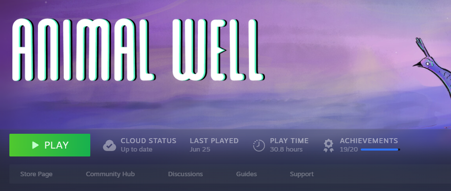
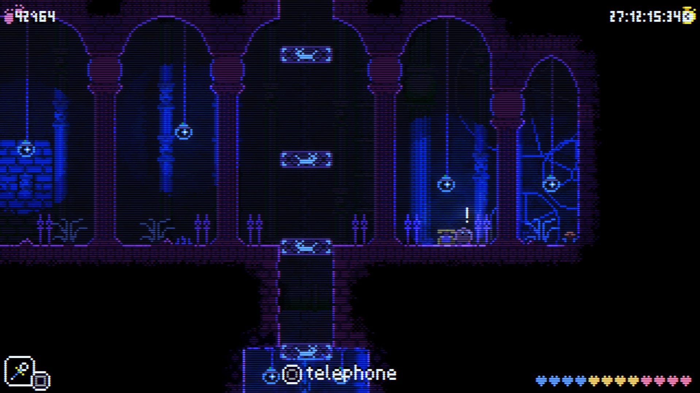

+++
title = 'Depression Is Sucks'
date = 2024-07-01T14:04:14-04:00
+++

Happy anti-gay month.

For the past couple years, I've been dealing with a huge depression. Mostly caused by my overwhelming cynicism about Humanity. It's not fun to make video games when you feel this way. Constantly waking up every single day to spend 12 hours working on a game and then going back to sleep. It's not that I *hate* making games, I really do love it, but it's extensively obvious that this is not what humans were designed to do.

Suicide is a constant thought I have every day, it's almost a joke at times. Very pathetic.

Happiness is overrated to be honest, comfort is more important right now. I just need the comfort to finish this game, and then we'll see what happens next...

In my efforts to distract myself from the dishonorable state of my mind, I've decided to buy play some new games, not really a thing I do anymore.

## Mini-Praise of Animal Well

Animal Well might be one of the greatest games of all time. Period. It's no Pizza Tower but it's definitely up there. The art, sound design, music, level design, it's just a **mastapeece**. It goes to show that there are still people willing to make good and high quality stuff out there. Excellent.

My only problem with the game is the save system, it pretty much only exists to facilitate nostalgia and nothing else. It's more of a checkpoint than an actual save. The game would've been better without it.

Hats off to Billy Basso.