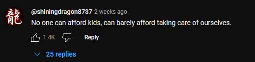
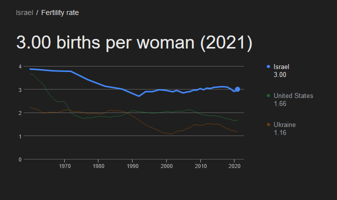

+++
title = 'The Consequences of a Childless America'
date = 2024-08-12T23:02:36-04:00
+++

## DRAFT #1

I've been very interested in population decline since I was about fifteen. I'm not sure why, probably just an autistic thought I've had for a while. I've decided to put my thoughts about it here.

When the Industrial Revolution happened, what we know as "modern society" was created, and we live in it today. Most people take advantage of this society without truly understanding how we've gotten to it. 
Because most people don't understand how society works or operates, they fail to also understand the implications of how their actions may impact the society they take advantage of.

## The Perpetuators

There are three main reasons people don't want to reproduce anymore (not counting people who just can't):
* Older generations have made life so shit for younger generations that they refuse to procreate anymore. 
* Older generations have made life so good for younger generations that they have better, more interesting, more fulfilling things to do with their time than to procreate.
* Mental illness.

The biggest perpetuator of these problem is, ironically enough, are capitalist business owners. Some <small>(or most)</small> companies do not support paid family leave, or any equivalent. This has led to most childless people to believe that they simply can't afford children.

And in **some** cases, they're probably right. *However*, in most instances the simple fact of the matter is that most humans are simply too hedonistic to actually care about reproducing. For most people, reproducing is a *very last* thing they want to do when they're absolutely confident that it won't "get in the way" of anything else in their lives. The obvious implication of this is millions of people who never reproduce because these people are never confident about anything.

To cope with this, they convince themselves that this is a "liberating" and "individual choice" that they're making instead of the most logical conclusion of living on a capitalist society that prioritizes profits over people. Instead of recognizing the issue with the system and choosing to reform or change out entirely, people have decided to continue playing along with the system while refusing to keep the game running. This will inevitably cause a huge societal disrupt.

## The Consequences

Most people I talk to would insist that the only reason they're working is so they can ride on retirement for maybe 15-30 years, but the problem is that the only way to make sure that your retirement is legitimate is if you have young people who are making sure that society is still running while you're sitting on your ass. If there's more people who are unable to work than people who are able to, *or more accurately*, if there are more people who are just consuming resources than creating, this is a recipe for economic disaster.

> "But shouldn’t pensions be supported by the people paying in to it? Rather than the next people to pay into it? Otherwise it seems a little bit like a pyramid scheme."

Duh? Did you think it was anything else? Why would you ever think that society was anything other than a big pyramid scheme? Dumbass.

The worst part of this is that no country has been successful in stopping this trend. They give out money, parental leave, tax cuts. Doesn't matter. We don't know how to stop it. We can only prevent it from happening, and even then only temporarily.

Unless you're Israel... Jesus. What's their secret?

The implication is obvious no matter which way you look at it: When people have other things they'd rather do, they choose not to have kids. This is a bug that really cannot be fixed. A bug that modern society is simply not compatible with. When people want to take advantage of a society that runs on young people's labor while refusing to create more young people... well... that's just the basic economic principle of supply and demand.

There's no real fixing this. As long as capitalism and, by extension, industrialism exists, this trend will continue to worsen and society will inevitably collapse. I don't know about you, but when I'm about sixty-something when that happens, I'll be hiding out in my bunker drinking Dr. Pepper waiting for the nukes to go off. No, you may not join me. Wait... who's making the Dr. Pepper?

Sorry, humans. Turns out hedonism always wins in the end. Man plans, God laughs.

Sad!